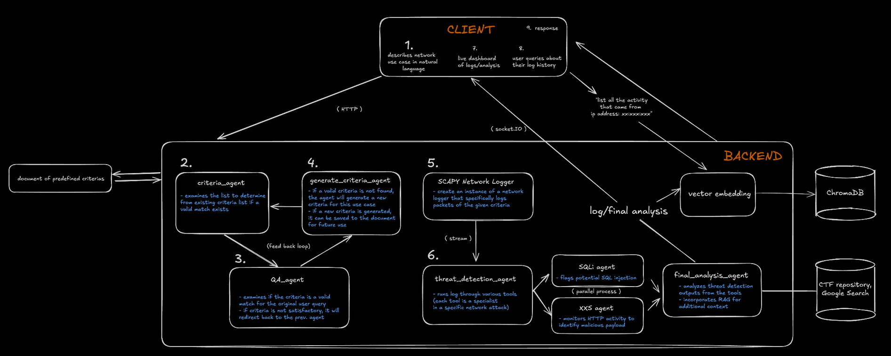

# NetSentry

## Background

The current state of modern network logging software (think Wireshark) provides an interface to monitor one’s network activity. While these solutions can accurately log such data, it is difficult to filter, monitor, and analyze packets in their raw format. Additionally, it becomes practically impossible for a user to manually analyze the hundreds of packets logged every few seconds for threat detection.

**But… AI can help with this! 😊**

## Our Solution

We built a multi-modal network logger to detect security threats in real-time, along with an interactive user experience to further understand, analyze, and prevent security threats on a computer.

### Initial User Experience

The user begins by providing a description, in natural language, of what they will be using their network for, along with any security concerns they might have. This query is sent to a multi-agent workflow to generate an initial filtering criteria for our network logger. This screening reduces the high volume of logs to a relevant subset of network activity.

### Multi-Agent Workflow

This criteria is selected or generated through a multi-agent workflow:

1. **Criteria Selector Agent:** Takes the user’s query and cross-references a repository of pre-defined criteria to find a valid match.
2. **Examiner Agent:** Reviews whether the selected criteria is an accurate filter for the query.
3. **Criteria Generation Agent:** If the Examiner is unsatisfied, this agent generates a new criteria that fits the user’s specific use case. The new output is then re-examined for accuracy.

We designed a **cyclic graph structure** of agents to ensure accuracy and mitigate LLM hallucinations. Additionally, when the Criteria Generation Agent defines a new criteria, it writes it to the initial criteria repository, allowing future references by the Criteria Selector Agent. This ensures our agentic system remains **stateful** and dynamically improves over time.

### Packet Sniffing & Analysis Workflow

To sniff packets on the client side, we built a **cross-platform desktop application** using **Electron**, which runs Python-executable scripts for network packet sniffing. These packets are streamed to our server, where they enter a **second multi-agent workflow for threat detection analysis:**

1. Root Node: Sends the packet into three specialized worker nodes:
   - XSS Agent
   - SQL Injection Agent
   - Payload Agent
2. Each worker examines the packet in its area of expertise and generates feedback.
3. The feedback is synthesized by a **terminal node** to make a final security decision.

Unlike the first workflow, this **packet analysis workflow prioritizes speed **by parallelizing LLM processes. While the first workflow resembles an **undirected cyclic graph**, this one is a **directed acyclic graph (DAG)**. The analysis output and packet metadata are displayed in a **real-time dashboard** for users.

### Querying Log History with RAG

After analysis, the packet’s metadata and analysis output are embedded and stored in a **vector database**. Users can query their logs using **semantic search** in natural language. The system retrieves and formats relevant results for easy understanding.

### Actionable Threat Resolution

Real-time threat detection is crucial, but users need clear steps to resolve malicious activity. Our app includes a **diagram-generation feature** that presents **actionable steps** and a **visual implementation guide** for addressing security threats.

## Tech Stack

- Frontend: Native desktop client with Electron and React, streamlined with shadcn and v0.dev.
- Backend: FastAPI for the server, ChromaDB for the vector store.
- AI Workflows:
  - LangChain/LangGraph framework for AI agents and workflows.
  - DeepSeek for complex queries.
  - Whisper for voice-to-text transcription.
  - Llama for AI agent processing.
    Groq for fast LLM inference in real-time threat detection.
